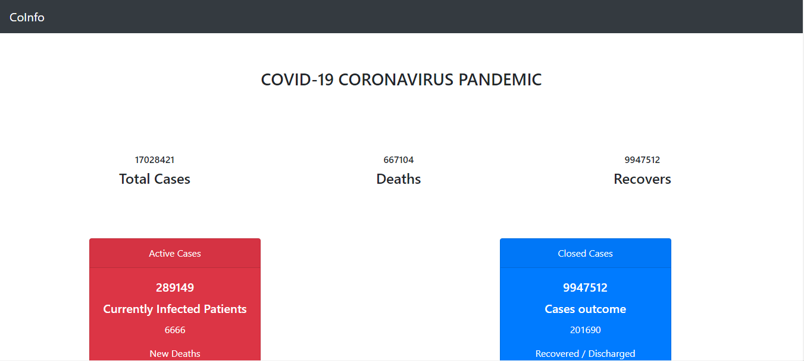

# Covid19Webapp

### COVID Tracking Project

The COVID Tracking Project collects information from worldwide territories to provide the most comprehensive testing data we can collect for the novel coronavirus.

**Technologies used**

- HTML
- CSS
- JAVASCRIPT
- BOOTSTRAP
- FETCH API

**What are fetch Apis ?**

The Fetch API provides an interface for fetching resources (including across the network). It will seem familiar to anyone who has used XMLHttpRequest, but the new API provides a more powerful and flexible feature set.

**SnapShot**

